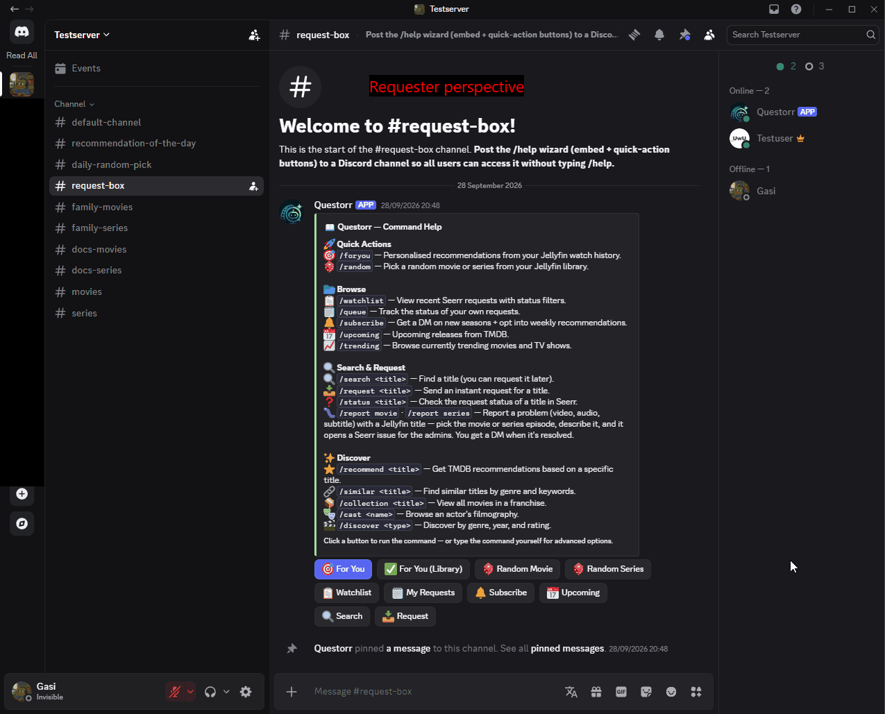
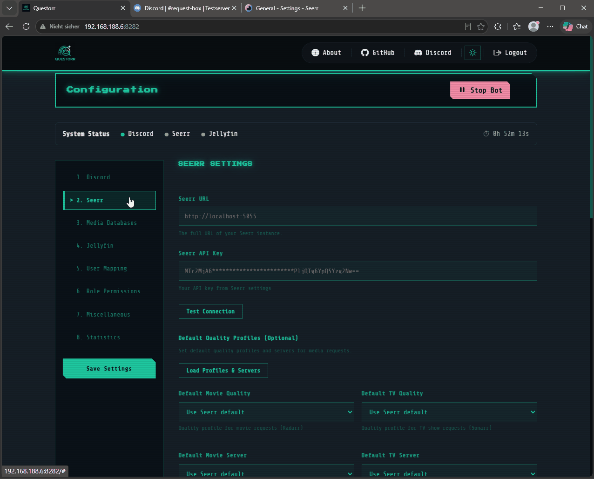
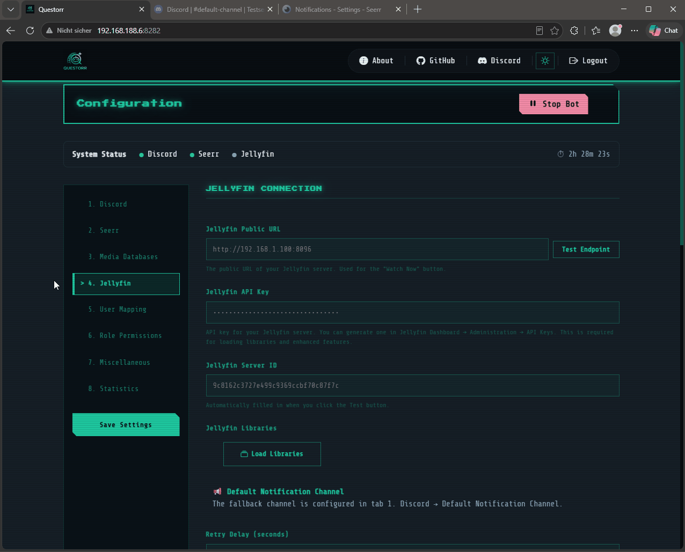

<div align="center">
  

  # Questorr

  **Um bot do Discord auto-hospedado que conecta Jellyfin e Seerr — com notificações inteligentes, roteamento automático de canais e um dashboard web completo.**

  [](https://github.com/Jellyforge-Dev/Questorr/releases)
  [](https://hub.docker.com/r/jellyforge/questorr)
  [](LICENSE)
  [](https://discord.gg/rXANrXJqVf)

  [🇬🇧 English](README.md) &nbsp;|&nbsp; [🇩🇪 Deutsch](README.de.md) &nbsp;|&nbsp; [🇫🇷 Français](README.fr.md) &nbsp;|&nbsp; [🇪🇸 Español](README.es.md) &nbsp;|&nbsp; [🇧🇷 Português (Brasil)](README.pt_br.md) &nbsp;|&nbsp; [🇸🇪 Svenska](README.sv.md)

  [💬 Comunidade no Discord](https://discord.gg/rXANrXJqVf) &nbsp;|&nbsp; [ Me pague um café](https://ko-fi.com/jellyforgedev) &nbsp;|&nbsp; [🐛 Reportar um bug](https://github.com/Jellyforge-Dev/Questorr/issues)

</div>

---

> **📸 Aviso de demo:** Todos os GIFs deste README vêm de um servidor de teste e não mostram dados reais de usuários. A versão em produção pode ter uma aparência ligeiramente diferente e mostrar mais conteúdo dependendo da sua configuração.

<div align="center">
  
</div>

---

## ✨ Funcionalidades

| Funcionalidade | Descrição |
|---|---|
| 🔍 `/search` | Pesquise filmes e séries e solicite diretamente pelo embed |
| 📤 `/request` | Solicitações instantâneas de mídia com seleção opcional de tag, servidor e qualidade |
| 🔥 `/trending` | Navegue pelos filmes e séries em alta da semana |
| 🔎 `/status` | Verifique o status de solicitação no Seerr de qualquer título — com pôster, sinopse, gênero, duração, avaliação e classificação indicativa. Mostra um botão de solicitação caso ainda não tenha sido pedido |
| 🎲 `/random` | Receba um filme ou série aleatório da sua biblioteca Jellyfin — com pôster, sinopse, gênero, duração e avaliação. Visível apenas para quem executou o comando |
| 🐛 `/report` | Relate um problema (vídeo / áudio / legenda) em um título do Jellyfin (`/report movie` · `/report series`). Abre um issue no Seerr; administradores comentam e resolvem diretamente pelo Discord, e o autor da denúncia recebe DMs |
| 💡 `/recommend` | Receba recomendações com base em um filme ou série via TMDB |
| 🧭 `/discover` | Descubra mídias por gênero, ano e avaliação mínima |
| 📦 `/collection` | Veja todos os filmes de uma franquia/coleção com disponibilidade |
| 🎭 `/cast` | Navegue pela filmografia completa de um ator com paginação |
| 🔗 `/similar` | Encontre títulos semelhantes com base em gênero e palavras-chave |
| 📥 `/queue` | Acompanhe o status das **suas próprias** solicitações — agrupadas por estágio (aguardando, baixando, disponível, recusada, falhou) |
| 🔔 `/subscribe` | Assine uma série para receber uma DM quando uma nova temporada for lançada, além de uma **DM opcional de recomendação semanal personalizada** |
| ✨ `/foryou` | Recomendações personalizadas com base no seu histórico de visualização no Jellyfin |
| 🔖 `/watchlist` | Veja as solicitações de mídia recentes do Seerr |
| 🕘 `/history` | Veja filmes e séries adicionados recentemente ao Jellyfin |
| 📅 `/upcoming` | Navegue pelos próximos lançamentos de filmes e novas séries do TMDB |
| ❓ `/help` | Mostra todos os comandos disponíveis com botões de ação rápida |
| 🆕 Resumo semanal | Post semanal opcional de novos filmes, séries **e episódios** adicionados à sua biblioteca Jellyfin |
| 🚦 Cota por usuário | Limite rolante opcional de 7 dias por usuário, com cargos de bypass e usuários ilimitados |
| 🔔 Notificações inteligentes | Embeds ricos do Discord para todos os eventos do Seerr (pendente, aprovado, disponível, recusado, falhou, problemas) |
| 📺 Roteamento de canais | Notificações roteadas automaticamente para o canal correto com base na pasta raiz do Radarr/Sonarr |
| 🔕 Eventos privados | Notificações de nova solicitação e recusa vão diretamente ao solicitante por DM — não para o canal público |
| ✉️ DMs privadas | Usuários recebem uma DM quando o conteúdo solicitado é aprovado, recusado ou fica disponível |
| 🔘 Alternância de botões | Escolha quais botões (Ver no Seerr, Assistir Agora, Letterboxd, IMDb) aparecem nos embeds de notificação |
| 👤 Vinculação de usuários | Vincule contas do Discord a contas do Seerr para que as solicitações apareçam do usuário correto |
| 🔐 Permissões por cargo | Controle quem pode usar os comandos do bot via allowlist / blocklist de cargos do Discord |
| 🌟 Recomendação diária | Poste uma sugestão diária da sua biblioteca Jellyfin existente |
| 🎲 Sugestão aleatória diária | Poste uma sugestão aleatória diária do TMDB |
| 🎨 Cores de embed personalizadas | Personalize as cores dos embeds de resultados de busca e confirmação de sucesso |
| ⚙️ Dashboard web | Configuração completa em `http://seu-servidor:8282` — interface no estilo Tetris |
| 🎨 Tema claro / escuro | Retro-escuro como padrão, além de um tema claro Paper-Terminal; a alternância é salva por navegador |
| 🛡️ Log de auditoria | Aba **Auditoria** do dashboard: quem aprovou/recusou uma solicitação, alterou a configuração, iniciou/parou o bot ou fez login |
| 🚨 Alertas de saúde | Opcional: publica em um canal de administração quando o Seerr ou o Jellyfin **cai** ou **se recupera** |
| ❤️ Verificação de saúde do container | `HEALTHCHECK` nativo do Docker em `/api/health` — Portainer / Docker / Uptime Kuma veem o container como saudável |
| 📱 Compatível com dispositivos móveis | Dashboard responsivo, funciona em smartphones e tablets |
| ✅ Status de disponibilidade | Todas as listas de embed mostram o status do Seerr: ✅ disponível, ⏳ solicitado, 📥 parcial |
| 🎬 Classificação indicativa | Classificações FSK/MPAA nos embeds de busca, configuráveis por país |
| 📡 Provedores de streaming | Mostra onde um título está disponível para streaming (Netflix, Disney+, etc.) |
| ▶️ Botões de trailer | Links de trailers do YouTube nos embeds de /search e /request |
| 💚 Barra de status de saúde | Exibição em tempo real do status dos serviços no dashboard |
| 📊 Dashboard de estatísticas | Estatísticas de uso de comandos com detalhamento por usuário |
| 🧩 Widget incorporável | Widget HTML para Homarr/Homepage/Organizr com status e controles do bot |
| 🌍 Multilíngue | Dashboard e bot totalmente traduzidos para inglês, alemão, francês, espanhol, português brasileiro e sueco |

> 📖 **Novo por aqui?** O [**Guia Completo de Uso e Configuração**](docs/USAGE.md) (em inglês) explica
> **todos** os comandos, funcionalidades e configurações em linguagem simples — incluindo o
> indicador de status do webhook do Seerr e a armadilha comum da URL do Docker.

---

## 📋 Pré-requisitos

- Um servidor **[Jellyfin](https://jellyfin.org/)** em funcionamento
- Uma instância **[Seerr](https://github.com/seerr-team/seerr)** em funcionamento (conectada ao [Radarr](https://github.com/Radarr/Radarr)/[Sonarr](https://github.com/Sonarr/Sonarr))
- Uma conta do **Discord** com acesso de administrador a um servidor
- **Docker** (recomendado) ou Node.js 20+
- Chaves de API: [TMDB](https://www.themoviedb.org/settings/api) (obrigatória) · [OMDb](http://www.omdbapi.com/apikey.aspx) (opcional)

---

## 🚀 Início Rápido

### Docker Compose (recomendado)

**Configuração padrão** — acesso direto via IP e porta:

```yaml
services:
  questorr:
    image: jellyforge/questorr:latest
    container_name: questorr
    restart: unless-stopped
    environment:
      - WEBHOOK_PORT=8282
      - NODE_ENV=production
    ports:
      - "8282:8282"
    volumes:
      - ./questorr-data:/usr/src/app/config
```

Em seguida, abra `http://ip-do-seu-servidor:8282` e siga o assistente de configuração.

**Com um proxy reverso** ([Nginx Proxy Manager](https://github.com/NginxProxyManager/nginx-proxy-manager), [Traefik](https://github.com/traefik/traefik), [Caddy](https://github.com/caddyserver/caddy)) — remova `ports` e adicione a rede compartilhada:

```yaml
services:
  questorr:
    image: jellyforge/questorr:latest
    container_name: questorr
    restart: unless-stopped
    environment:
      - WEBHOOK_PORT=8282
      - NODE_ENV=production
    volumes:
      - ./questorr-data:/usr/src/app/config
    networks:
      - proxy             # Deve corresponder ao nome da rede do seu proxy reverso

networks:
  proxy:                  # Deve corresponder ao nome da rede do seu proxy reverso
    external: true
```

Configurações de encaminhamento do proxy reverso: Esquema: `http` · Host / Forward hostname: `questorr` · Porta: `8282`

### Tags do Docker

| Tag | Descrição |
|---|---|
| `latest` | Última versão estável |
| `dev` | Build de desenvolvimento (pode ser instável) |
| ex.: `2.4.5` | Versão específica fixada — veja [Releases](https://github.com/Jellyforge-Dev/Questorr/releases) para todas as tags |

### Manual (Desenvolvimento)

```bash
git clone https://github.com/Jellyforge-Dev/Questorr.git
cd Questorr
npm install
node app.js
```

---

## ⚙️ Configuração

### 1. Crie um Bot do Discord

1. Vá para o [Discord Developer Portal](https://discord.com/developers/applications) → New Application
2. **Bot** → Reset Token para obter um token, depois ative `Server Members Intent` (necessário para a vinculação de usuários)
3. **OAuth2** → copie o **Client ID**
4. Cole ambos no dashboard do Questorr (Etapa 1) e clique em **"Convidar bot para o servidor"** — o dashboard monta o link de convite para você com exatamente as permissões necessárias (`Send Messages`, `Embed Links`, `Pin Messages`), sem necessidade de gerar manualmente a URL no OAuth2 URL Generator

### 2. Configure pelo Dashboard Web

Abra `http://ip-do-seu-servidor:8282`, crie uma conta e conclua todas as etapas:

| Etapa | O que configurar |
|---|---|
| 1. Discord | Token do bot, client ID, servidor, canal de notificação padrão |
| 2. Seerr | URL do Seerr, chave de API, URL do webhook, roteamento de canais, mapeamento de pastas raiz |
| 3. Bancos de dados de mídia | Chave de API do TMDB (obrigatória), chave de API do OMDb (opcional) |
| 4. Jellyfin | URL do servidor, chave de API, ID do servidor, canal de notificação |
| 5. Vinculação de usuários | Vincule usuários do Discord a contas do Seerr |
| 6. Permissões por cargo | Allowlist / blocklist para comandos do bot |
| 7. Diversos | Auto-início, DMs, picks diários, cores de embed, opções de `/request`, comandos do Discord, botões de notificação |

### 3. Configure o Webhook do Seerr

Em **Seerr → Settings → Notifications → Webhook**, configure o seguinte:

| Campo | Valor |
|---|---|
| Webhook URL | A URL exibida no Questorr em **Etapa 2 → Seerr Webhook URL** |
| Authorization Header | Cole o segredo exibido em **Etapa 2 → Copiar Segredo** |

> O segredo é transmitido pelo header `Authorization` — ele nunca aparece na URL nem nos logs do servidor.

**Recomendado: ative todos os tipos de notificação no Seerr** para que o Questorr possa encaminhar todo o ciclo de vida da solicitação ao Discord:

| Evento do Seerr | O que o Questorr faz |
|---|---|
| Solicitação pendente de aprovação | Publica no **canal de administração** (com botões Aprovar/Recusar) · envia DM ao solicitante |
| Solicitação aprovada / aprovada automaticamente | Publica no canal padrão · envia DM ao solicitante |
| Mídia disponível | Publica no canal da pasta raiz correspondente · envia DM ao solicitante |
| Solicitação recusada | Envia DM apenas ao solicitante |
| Falha no download | Publica no canal de administração |
| Problema criado | Publica no **canal de administração** (com botões de Comentar / Resolver) |
| Comentário / resolução / reabertura de problema | Envia uma **DM ao autor da denúncia** (para acompanhamentos de `/report`) |

> **Para que `/report` funcione**, ative os issues em **Seerr → Settings → General**
> (*Enable Issue Reporting*) e marque os eventos de webhook de **Issue** acima.
> Como o Questorr atua como o **usuário do Seerr vinculado** (Etapa 5), esse usuário
> precisa da permissão correspondente do Seerr para cada ação — **Request** para
> solicitar, **Auto-Approve** para aprovação instantânea, **Report Issues** para `/report`.

> ⚠️ **Deixe seu canal de administração privado.** Os botões de Aprovar/
> Recusar em uma solicitação pendente **não têm verificação de permissão
> própria** — clicar neles chama o Seerr com a própria chave de API do
> Questorr, que tem permissão para aprovar ou recusar *qualquer* solicitação.
> Qualquer pessoa que consiga ver esse canal pode, na prática, agir com o
> mesmo poder da sua chave de API do Seerr. Se você não usa a aprovação
> automática do Seerr, restrinja as permissões do Discord do canal de
> administração para que somente admins/moderadores de confiança possam
> vê-lo — caso contrário, qualquer membro que acabe tendo acesso a esse
> canal pode aprovar suas próprias solicitações (ou as de outras pessoas).

### 4. Roteamento de Canais

Em **Etapa 2 → Root Folder → Channel Mapping**, clique em **Load Root Folders** e depois atribua um canal do Discord a cada pasta raiz do Radarr/Sonarr. O Questorr roteará automaticamente as notificações `MEDIA_AVAILABLE` para o canal correto — por exemplo, solicitações de anime vão para `#anime`, filmes para `#filmes`.

### 5. Botões de Notificação

Em **Etapa 7 → Notification Buttons**, você pode ativar ou desativar individualmente quais botões aparecem nos embeds de notificação do Discord:

| Botão | Descrição |
|---|---|
| Ver no Seerr | Link para a página da mídia no Seerr |
| ▶ Assistir Agora! | Link direto para o player do Jellyfin (apenas para conteúdo disponível) |
| Letterboxd | Link para a página no Letterboxd (apenas filmes) |
| IMDb | Link para a página no IMDb |

Use o botão **Test Buttons** para enviar uma notificação de prévia ao seu canal de administração mostrando os botões atualmente ativos.

---

## 🌐 Variáveis de Ambiente

| Variável | Descrição | Padrão |
|---|---|---|
| `WEBHOOK_PORT` | Porta do servidor web | `8282` |
| `LOG_LEVEL` | `error` / `warn` / `info` / `verbose` / `debug` | `info` |
| `TRUST_PROXY` | Defina como `false` para desativar o trust proxy (ex.: sem proxy reverso) | `true` |

Todas as outras configurações são gerenciadas pelo dashboard web e salvas em `config/config.json`.

---

## 🔒 Segurança

O Questorr inclui os seguintes reforços de segurança:

| Funcionalidade | Detalhes |
|---|---|
| Container sem privilégios de root | O processo é executado como usuário `app` via `entrypoint.sh` + `su-exec` |
| Content Security Policy | Headers de CSP rígidos via `helmet` — scripts inline bloqueados, `frame-ancestors: none` |
| Header de autorização | O segredo do webhook é transmitido pelo header `Authorization`, nunca na URL |
| Proteção contra força bruta | Bloqueios de login persistem entre reinicializações do container (gravados em disco) |
| Limitação de taxa | Endpoints de API, configuração e webhook têm limitação de taxa |
| Trust proxy configurável | `TRUST_PROXY=false` desativa o trust proxy para implantações diretas |
| Permissões de diretório | Diretórios de configuração criados com `0o755` em vez de `0o777` |
| Log de auditoria | Acessos ao segredo do webhook e à chave de API do widget são registrados |
| Atualizações de dependências | Todas as dependências npm atualizadas, 0 vulnerabilidades conhecidas |

---

## 🔮 Roadmap

Solicitações de funcionalidades aprovadas são acompanhadas no quadro público do projeto:

➡️ **[Roadmap do Questorr →](https://github.com/orgs/Jellyforge-Dev/projects/1)**

Tem uma ideia? [Abra uma solicitação de funcionalidade](https://github.com/Jellyforge-Dev/Questorr/issues/new?template=feature_request.yml) — depois de revisada e aprovada, ela entra no quadro.

---

## 🎬 Veja em ação

> Os GIFs vêm de um servidor de teste sem dados reais.

### Usando o bot

<details>
<summary><b>O fluxo completo de solicitação — busca, solicitação, aprovação do administrador, "disponível agora"</b></summary>


> `/search` encontra um título via TMDB; clicar em **Solicitar** o envia
> ao Seerr. Se o **Auto-Approve Requests** do Seerr estiver desativado, a
> solicitação vai para o canal de administração para Aprovar/Recusar (veja
> a Etapa 7 abaixo) — caso contrário, é solicitada imediatamente e o
> Discord publica novamente assim que estiver disponível.

</details>

<details>
<summary><b>O assistente /help — botões de ação rápida para cada funcionalidade</b></summary>


> `/help` abre um assistente com botões de um clique para cada
> funcionalidade abaixo — sem precisar decorar comandos. **For You**
> monta recomendações do TMDB a partir do seu histórico real de
> visualização no Jellyfin.

</details>

<details>
<summary><b>Filme / Série aleatória</b></summary>


> `/random` escolhe um título direto da sua **biblioteca Jellyfin** (não
> do TMDB) — útil para "o que assistir hoje à noite" em vez de descobrir
> algo novo para solicitar.

</details>

<details>
<summary><b>Daily Random Pick & Daily Recommendation</b></summary>


> A seleção aleatória diária e a recomendação diária são publicadas
> automaticamente em um horário que você define na Etapa 7 — uma mostra
> um título aleatório da sua biblioteca Jellyfin existente, a outra uma
> nova sugestão do TMDB.

</details>

---

### Configuração do dashboard

<details>
<summary><b>Etapa 1 – Configurações do Discord</b></summary>


> O Questorr faz upload automático do próprio logo como avatar do bot no
> Discord na primeira vez que inicia — não é necessário definir um
> manualmente, a menos que você queira algo diferente.

</details>

<details>
<summary><b>Etapa 2 – Configuração do Seerr</b></summary>



> **Root Folder → Channel Mapping** roteia notificações de "disponível
> agora" de acordo com a pasta raiz do Radarr/Sonarr onde o download caiu
> (ex.: sua pasta raiz de Anime → `#anime`). Isso exige que o Seerr se
> comunique com o Radarr/Sonarr, e é o *primeiro* nível de roteamento que
> o Questorr tenta — veja a etapa 4 abaixo para o que acontece quando não
> há correspondência (ou nem está configurado).

</details>

<details>
<summary><b>Etapa 3 – Bancos de Dados de Mídia (TMDB / OMDb)</b></summary>


> Obtenha uma **chave de API do TMDB** gratuita em
> [themoviedb.org/settings/api](https://www.themoviedb.org/settings/api)
> (obrigatória para busca e pôsteres) e uma **chave de API do OMDb**
> opcional em [omdbapi.com/apikey.aspx](https://www.omdbapi.com/apikey.aspx)
> para dados de avaliação mais completos.

</details>

<details>
<summary><b>Etapa 4 – Conexão com o Jellyfin</b></summary>



> **Jellyfin Library → Channel Mapping** cumpre duas funções. Primeiro, é
> o *segundo* nível de roteamento para notificações disparadas pelo Seerr,
> usado quando o mapeamento por pasta raiz acima (etapa 2) não bate.
> Segundo — e independentemente — ele alimenta o próprio observador de
> biblioteca do Jellyfin do Questorr, que detecta conteúdo novo
> diretamente no Jellyfin (não importa como chegou lá) e publica no canal
> correspondente a essa biblioteca. **Você pode configurar só esta etapa
> e pular Seerr/Radarr/Sonarr completamente** se tudo que você quer é que
> o Discord anuncie conteúdo novo da biblioteca, sem nenhum fluxo de
> solicitação/aprovação.

</details>

<details>
<summary><b>Etapa 5 – Vinculação de Usuários</b></summary>


> Vincular um usuário do Discord à sua conta do Seerr faz com que as
> solicitações dessa pessoa apareçam em seu nome no Seerr (não como
> "Admin"), habilita o `/watchlist filter:mine` para mostrar apenas as
> próprias solicitações e permite que o **For You** monte recomendações
> personalizadas a partir do histórico de visualização dessa pessoa no
> Jellyfin.

</details>

<details>
<summary><b>Etapa 6 – Permissões por Cargo & cota de solicitações</b></summary>


> Restrinja quem pode usar o bot através de uma allowlist/blocklist de
> cargos do Discord e, opcionalmente, limite quantas solicitações cada
> usuário pode fazer em uma janela móvel de 7 dias — útil se você
> compartilha seu servidor com muita gente.

</details>

<details>
<summary><b>Etapa 7 – Diversos (Widget, assinaturas, seleção diária)</b></summary>


> ⚠️ O **Seerr Auto-Approve Requests** (ativado aqui) decide se uma
> solicitação é aprovada instantaneamente ou cai no canal de
> administração que você atribuiu na Etapa 2 para um humano
> Aprovar/Recusar. Com a aprovação automática desativada, **garanta que
> as permissões do Discord desse canal de administração estejam
> restritas apenas a admins/moderadores de confiança** — os botões de
> Aprovar/Recusar têm o mesmo poder que sua chave de API do Seerr, sem
> verificação de permissão própria.

</details>

---

## 🐳 Atualização

```bash
docker pull jellyforge/questorr:latest
docker compose up -d
```

---

## 📄 Licença

Este projeto é licenciado sob a [GNU Affero General Public License v3.0 (AGPL-3.0)](LICENSE). Você é livre para usar, modificar e distribuir este software sob os termos da AGPL-3.0. Se você executar uma versão modificada como um serviço web, deve disponibilizar o código-fonte.

---

<div align="center">

Mantido por [Jellyforge-Dev](https://github.com/Jellyforge-Dev) &nbsp;|&nbsp; [💬 Discord](https://discord.gg/rXANrXJqVf) &nbsp;|&nbsp; [ Me pague um café](https://ko-fi.com/jellyforgedev)

</div>
