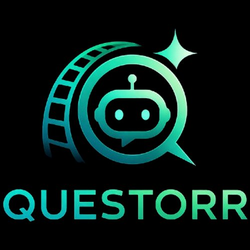
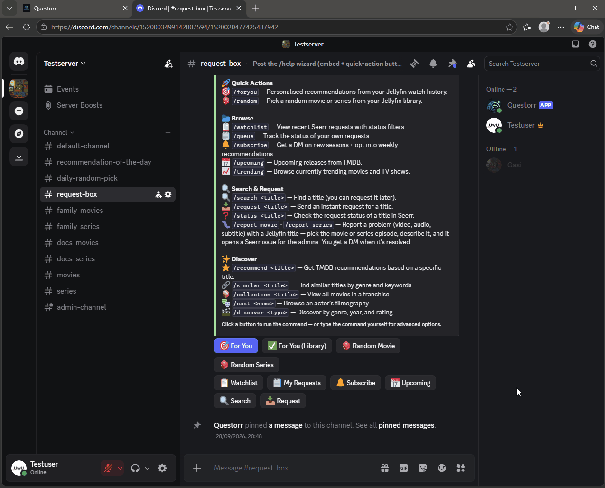
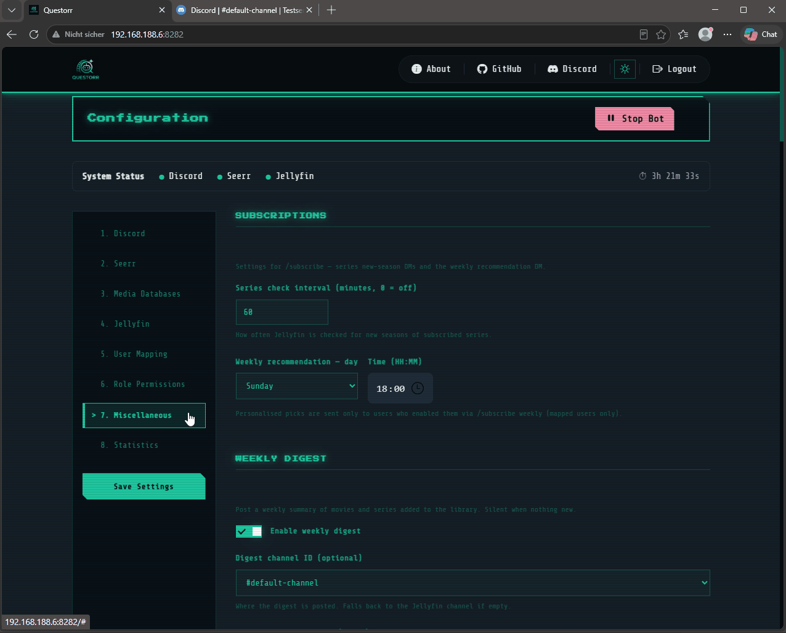
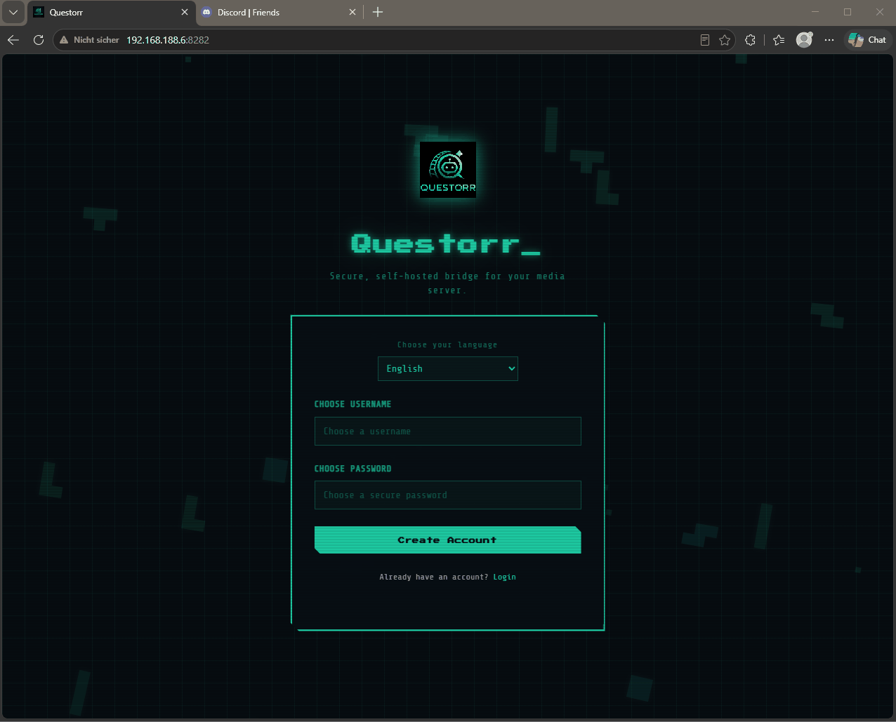
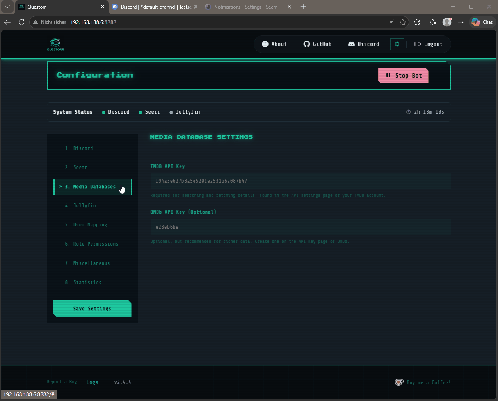
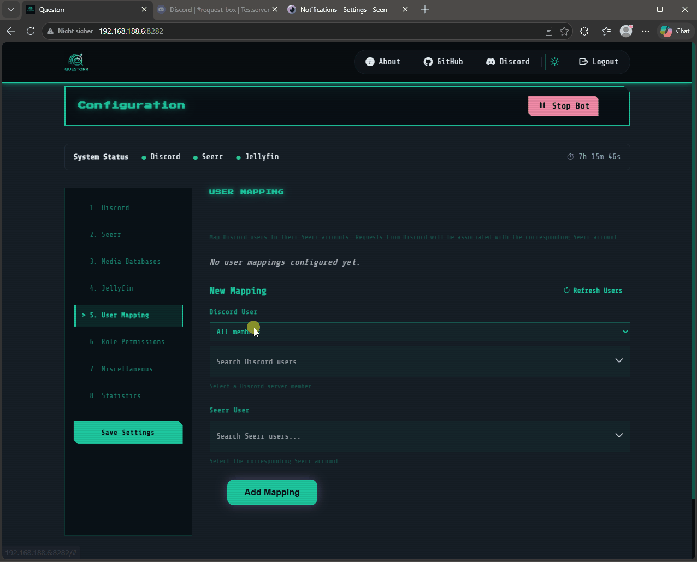
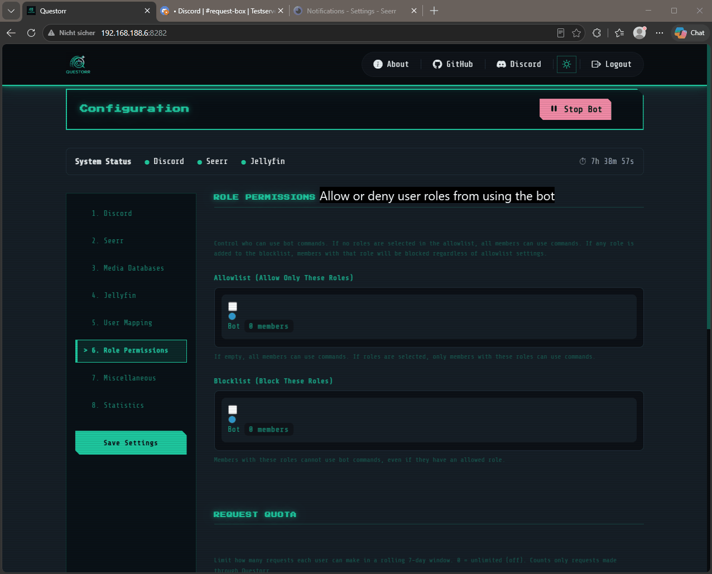
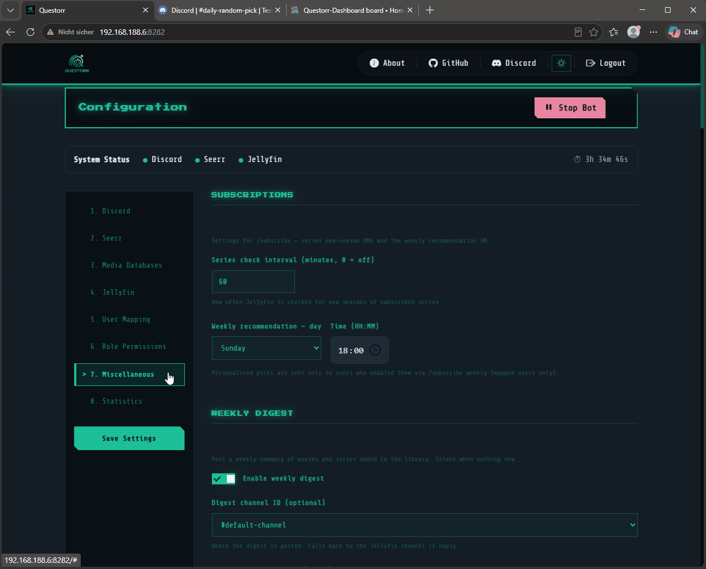

<div align="center">
  

  # Questorr

  **En självhostad Discord-bot som länkar samman Jellyfin och Seerr — med smarta notiser, automatisk kanalroutning och ett fullständigt webbdashboard.**

  [](https://github.com/Jellyforge-Dev/Questorr/releases)
  [](https://hub.docker.com/r/jellyforge/questorr)
  [](LICENSE)
  [](https://discord.gg/rXANrXJqVf)

  [🇬🇧 English](README.md) &nbsp;|&nbsp; [🇩🇪 Deutsch](README.de.md) &nbsp;|&nbsp; [🇫🇷 Français](README.fr.md) &nbsp;|&nbsp; [🇪🇸 Español](README.es.md) &nbsp;|&nbsp; [🇧🇷 Português (Brasil)](README.pt_br.md) &nbsp;|&nbsp; [🇸🇪 Svenska](README.sv.md)

  [💬 Discord-community](https://discord.gg/rXANrXJqVf) &nbsp;|&nbsp; [ Bjud mig på en kaffe](https://ko-fi.com/jellyforgedev) &nbsp;|&nbsp; [🐛 Rapportera en bugg](https://github.com/Jellyforge-Dev/Questorr/issues)

</div>

---

> **📸 Demo-notis:** Alla GIF:ar i denna README är inspelade från en testserver och visar ingen riktig användardata. Livemiljön kan se lite annorlunda ut och visa mer innehåll beroende på din konfiguration.

<div align="center">
  
</div>

---

## ✨ Funktioner

| Funktion | Beskrivning |
|---|---|
| 🔍 `/search` | Sök efter filmer och serier, begär direkt från embedet |
| 📤 `/request` | Direkta medieförfrågningar med valfritt tagg-, server- och kvalitetsval |
| 🔥 `/trending` | Bläddra bland veckans mest populära filmer och serier |
| 🔎 `/status` | Kontrollera Seerr-förfrågningsstatus för en titel — med affisch, sammanfattning, genre, speltid, betyg och åldersgräns. Visar en Begär-knapp om den inte redan begärts |
| 🎲 `/random` | Få en slumpmässig film eller serie från ditt Jellyfin-bibliotek — med affisch, sammanfattning, genre, speltid och betyg. Synlig endast för den som kör kommandot |
| 🐛 `/report` | Rapportera ett problem (video / ljud / undertext) med en Jellyfin-titel (`/report movie` · `/report series`). Öppnar ett Seerr-ärende; administratörer kommenterar & löser direkt från Discord, och anmälaren får DM |
| 💡 `/recommend` | Få rekommendationer baserat på en film eller serie via TMDB |
| 🧭 `/discover` | Upptäck media efter genre, år och minimibetyg |
| 📦 `/collection` | Se alla filmer i en filmserie/samling med tillgänglighet |
| 🎭 `/cast` | Bläddra i en skådespelares fullständiga filmografi med paginering |
| 🔗 `/similar` | Hitta liknande titlar baserat på genre och nyckelord |
| 📥 `/queue` | Följ status för **dina egna** förfrågningar — grupperade efter fas (väntar, laddar ner, tillgänglig, nekad, misslyckad) |
| 🔔 `/subscribe` | Prenumerera på en serie för en DM när en ny säsong släpps, plus en valfri **personlig veckorekommendation via DM** |
| ✨ `/foryou` | Personliga rekommendationer baserat på din Jellyfin-tittarhistorik |
| 🔖 `/watchlist` | Se senaste medieförfrågningarna från Seerr |
| 🕘 `/history` | Se nyligen tillagda filmer och serier på Jellyfin |
| 📅 `/upcoming` | Bläddra bland kommande filmpremiärer och nya serier från TMDB |
| ❓ `/help` | Visa alla tillgängliga kommandon med snabbknappar |
| 🆕 Veckosammanfattning | Valfritt veckoinlägg med nya filmer, serier **och avsnitt** som lagts till i ditt Jellyfin-bibliotek |
| 🚦 Kvot per användare | Valfri rullande 7-dagarsgräns för förfrågningar per användare, med undantagsroller och obegränsade användare |
| 🔔 Smarta notiser | Rika Discord-embeds för alla Seerr-händelser (väntande, godkänd, tillgänglig, nekad, misslyckad, ärenden) |
| 📺 Kanalroutning | Notiser routas automatiskt till rätt kanal baserat på Radarr/Sonarr root-folder |
| 🔕 Privata händelser | Nya och nekade förfrågningar skickas direkt till den som frågade som DM — inte till den publika kanalen |
| ✉️ Privata DM | Användare får en DM när deras begärda innehåll godkänns, nekas eller blir tillgängligt |
| 🔘 Knapp-toggles | Välj vilka knappar (Visa i Seerr, Titta nu, Letterboxd, IMDb) som visas på notis-embeds |
| 👤 Användarkoppling | Länka Discord-konton till Seerr-konton så att förfrågningar visas från rätt användare |
| 🔐 Rollbehörigheter | Styr vem som får använda bot-kommandon via Discord roll-allowlist / blocklist |
| 🌟 Dagens rekommendation | Posta ett dagligt förslag från ditt befintliga Jellyfin-bibliotek |
| 🎲 Dagligt slumpval | Posta ett dagligt slumpmässigt förslag från TMDB |
| 🎨 Anpassade embed-färger | Anpassa färgerna för sökresultat- och bekräftelse-embeds |
| ⚙️ Webbdashboard | Fullständig konfiguration på `http://din-server:8282` — Tetris-inspirerat gränssnitt |
| 🎨 Mörkt / ljust tema | Retro-mörkt som standard plus ett Paper-Terminal-ljust tema; växlingen sparas per webbläsare |
| 🛡️ Granskningslogg | Dashboard-fliken **Audit**: vem som godkänt/nekat, ändrat config, startat/stoppat boten eller loggat in |
| 🚨 Hälsolarm | Valfritt: postar till en adminkanal när Seerr eller Jellyfin går **ner** eller **återhämtar sig** |
| ❤️ Container-hälsokontroll | Inbyggd Docker-`HEALTHCHECK` på `/api/health` — Portainer / Docker / Uptime Kuma ser containern som frisk |
| 📱 Mobilvänlig | Responsivt dashboard, fungerar på smartphones och surfplattor |
| ✅ Tillgänglighetsstatus | Alla embed-listor visar Seerr-status: ✅ tillgänglig, ⏳ begärd, 📥 delvis |
| 🎬 Åldersgränser | FSK/MPAA-åldersgränser i sök-embeds, konfigurerbart per land |
| 📡 Streamingtjänster | Visar var en titel är tillgänglig för streaming (Netflix, Disney+, etc.) |
| ▶️ Trailerknappar | YouTube-trailerlänkar i /search- och /request-embeds |
| 💚 Hälsokontrollrad | Realtidsstatus för tjänster i dashboardet |
| 📊 Statistik-dashboard | Kommandoanvändningsstatistik med uppdelning per användare |
| 🧩 Inbäddningsbar widget | HTML-widget för Homarr/Homepage/Organizr med bot-status och styrning |
| 🌍 Flerspråkigt | Dashboard och bot fullständigt översatta till engelska, tyska, franska, spanska, brasiliansk portugisiska och svenska |

> 📖 **Ny här?** [**Den fullständiga användar- och konfigurationsguiden**](docs/USAGE.md) (på engelska) förklarar
> **varje** kommando, funktion och inställning i vanligt språk — inklusive
> Seerr-webhook-statuslampan och den vanliga Docker-URL-fällan.

---

## 📋 Förutsättningar

- En körande **[Jellyfin](https://jellyfin.org/)**-server
- En körande **[Seerr](https://github.com/seerr-team/seerr)**-instans (ansluten till [Radarr](https://github.com/Radarr/Radarr)/[Sonarr](https://github.com/Sonarr/Sonarr))
- Ett **Discord**-konto med adminbehörighet till en server
- **Docker** (rekommenderas) eller Node.js 20+
- API-nycklar: [TMDB](https://www.themoviedb.org/settings/api) (krävs) · [OMDb](http://www.omdbapi.com/apikey.aspx) (valfritt)

---

## 🚀 Snabbstart

### Docker Compose (rekommenderas)

**Standardinställning** — direkt åtkomst via IP och port:

```yaml
services:
  questorr:
    image: jellyforge/questorr:latest
    container_name: questorr
    restart: unless-stopped
    environment:
      - WEBHOOK_PORT=8282
      - NODE_ENV=production
    ports:
      - "8282:8282"
    volumes:
      - ./questorr-data:/usr/src/app/config
```

Öppna sedan `http://din-server-ip:8282` och följ installationsguiden.

**Med en reverse proxy** ([Nginx Proxy Manager](https://github.com/NginxProxyManager/nginx-proxy-manager), [Traefik](https://github.com/traefik/traefik), [Caddy](https://github.com/caddyserver/caddy)) — ta bort `ports` och lägg till det delade nätverket istället:

```yaml
services:
  questorr:
    image: jellyforge/questorr:latest
    container_name: questorr
    restart: unless-stopped
    environment:
      - WEBHOOK_PORT=8282
      - NODE_ENV=production
    volumes:
      - ./questorr-data:/usr/src/app/config
    networks:
      - proxy             # Måste matcha nätverksnamnet för din reverse proxy

networks:
  proxy:                  # Måste matcha nätverksnamnet för din reverse proxy
    external: true
```

Inställningar för reverse proxy-vidarebefordran: Schema: `http` · Host / vidarebefordrat värdnamn: `questorr` · Port: `8282`

### Docker-taggar

| Tagg | Beskrivning |
|---|---|
| `latest` | Senaste stabila version |
| `dev` | Utvecklingsbygge (kan vara instabilt) |
| t.ex. `2.4.4` | Specifik fastsatt version — se [Releases](https://github.com/Jellyforge-Dev/Questorr/releases) för alla taggar |

### Manuellt (utveckling)

```bash
git clone https://github.com/Jellyforge-Dev/Questorr.git
cd Questorr
npm install
node app.js
```

---

## ⚙️ Konfiguration

### 1. Skapa en Discord-bot

1. Gå till [Discord Developer Portal](https://discord.com/developers/applications) → New Application
2. **Bot** → Reset Token för att få en token, aktivera sedan `Server Members Intent` (krävs för användarkoppling)
3. **OAuth2** → kopiera **Client ID**
4. Klistra in båda i Questorrs dashboard (steg 1) och klicka på **"Invite Bot to Server"** — dashboardet bygger inbjudningslänken åt dig med exakt de behörigheter som krävs (`Send Messages`, `Embed Links`, `Pin Messages`), inget manuellt OAuth2-URL-generatorsteg krävs

### 2. Konfigurera via webbdashboardet

Öppna `http://din-server-ip:8282`, skapa ett konto och slutför alla steg:

| Steg | Vad som ska konfigureras |
|---|---|
| 1. Discord | Bot-token, klient-ID, server, standardnotiskanal |
| 2. Seerr | Seerr-URL, API-nyckel, webhook-URL, kanalroutning, root-folder-koppling |
| 3. Mediedatabaser | TMDB API-nyckel (krävs), OMDb API-nyckel (valfritt) |
| 4. Jellyfin | Server-URL, API-nyckel, server-ID, notiskanal |
| 5. Användarkoppling | Länka Discord-användare till Seerr-konton |
| 6. Rollbehörigheter | Allowlist / blocklist för bot-kommandon |
| 7. Övrigt | Autostart, DM, dagliga förslag, embed-färger, `/request`-alternativ, Discord-kommandon, notisknappar |

### 3. Konfigurera Seerr-webhook

I **Seerr → Settings → Notifications → Webhook**, ange följande:

| Fält | Värde |
|---|---|
| Webhook-URL | URL:en som visas i Questorr under **steg 2 → Seerr Webhook URL** |
| Authorization Header | Klistra in hemligheten som visas under **steg 2 → Copy Secret** |

> Hemligheten skickas via `Authorization`-headern — den visas aldrig i URL:en eller i serverloggar.

**Rekommenderas: aktivera alla notistyper i Seerr** så att Questorr kan vidarebefordra hela förfrågningsflödet till Discord:

| Seerr-händelse | Vad Questorr gör |
|---|---|
| Förfrågan väntar på godkännande | Postar i **adminkanalen** (med Godkänn-/Neka-knappar) · skickar DM till den som frågade |
| Förfrågan godkänd / automatiskt godkänd | Postar i standardkanalen · skickar DM till den som frågade |
| Media tillgänglig | Postar i matchande root-folder-kanal · skickar DM till den som frågade |
| Förfrågan nekad | Skickar DM endast till den som frågade |
| Nedladdning misslyckades | Postar i adminkanalen |
| Ärende skapat | Postar i **adminkanalen** (med Kommentera-/Lös-knappar) |
| Ärende kommenterat / löst / återöppnat | Skickar en **DM till anmälaren** (för `/report`-uppföljningar) |

> **För att `/report` ska fungera**, aktivera ärenden i **Seerr → Settings → General**
> (*Enable Issue Reporting*) och bocka i **Issue**-webhook-händelserna ovan.
> Eftersom Questorr agerar som den **kopplade Seerr-användaren** (steg 5) behöver
> den användaren rätt Seerr-behörighet för varje åtgärd — **Request** för att
> begära, **Auto-Approve** för direkt godkännande, **Report Issues** för `/report`.

> ⚠️ **Gör din adminkanal privat.** Godkänn-/Neka-knapparna på en väntande
> förfrågan har **ingen egen behörighetskontroll** — att klicka på dem
> anropar Seerr med Questorrs egen API-nyckel, som har rätt att godkänna
> eller neka *vilken* förfrågan som helst. Alla som kan se den kanalen kan
> i praktiken agera med samma makt som din Seerr-API-nyckel. Om du inte
> använder Seerrs auto-godkännande, begränsa adminkanalens Discord-
> behörigheter så att bara betrodda admins/moderatorer kan se den — annars
> kan vilken medlem som helst som hamnar i den kanalen godkänna sina egna
> (eller andras) förfrågningar.

### 4. Kanalroutning

Under **steg 2 → Root Folder → Channel Mapping**, klicka på **Load Root Folders** och tilldela sedan en Discord-kanal till varje Radarr/Sonarr root-folder. Questorr routar automatiskt `MEDIA_AVAILABLE`-notiser till rätt kanal — till exempel går animeförfrågningar till `#anime`, filmer till `#filmer`.

### 5. Notisknappar

Under **steg 7 → Notification Buttons** kan du individuellt aktivera eller inaktivera vilka knappar som visas på Discord-notis-embeds:

| Knapp | Beskrivning |
|---|---|
| Visa i Seerr | Länkar till mediesidan i Seerr |
| ▶ Titta nu! | Direktlänk till Jellyfin-spelaren (endast tillgängligt innehåll) |
| Letterboxd | Länkar till Letterboxd-sidan (endast filmer) |
| IMDb | Länkar till IMDb-sidan |

Använd knappen **Test Buttons** för att skicka en förhandsvisningsnotis till din adminkanal som visar de för närvarande aktiva knapparna.

---

## 🌐 Miljövariabler

| Variabel | Beskrivning | Standard |
|---|---|---|
| `WEBHOOK_PORT` | Webbserverport | `8282` |
| `LOG_LEVEL` | `error` / `warn` / `info` / `verbose` / `debug` | `info` |
| `TRUST_PROXY` | Sätt till `false` för att inaktivera trust proxy (t.ex. utan reverse proxy) | `true` |

Alla andra inställningar hanteras via webbdashboardet och sparas i `config/config.json`.

---

## 🔒 Säkerhet

Questorr innehåller följande säkerhetshärdning:

| Funktion | Detaljer |
|---|---|
| Container utan root | Processen körs som `app`-användaren via `entrypoint.sh` + `su-exec` |
| Content Security Policy | Strikta CSP-headers via `helmet` — inline-skript blockerade, `frame-ancestors: none` |
| Authorization-header | Webhook-hemligheten skickas via `Authorization`-headern, aldrig i URL:en |
| Brute-force-skydd | Inloggningsspärrar kvarstår över container-omstarter (skrivs till disk) |
| Rate limiting | API-, konfigurations- och webhook-endpoints är rate-limiterade |
| Konfigurerbar trust proxy | `TRUST_PROXY=false` inaktiverar proxy-tillit för direkta driftsättningar |
| Katalogbehörigheter | Konfigurationskataloger skapas med `0o755` istället för `0o777` |
| Granskningslogg | Åtkomst till webhook-hemlighet och widget-API-nyckel loggas |
| Beroendeuppdateringar | Alla npm-beroenden uppdaterade, 0 kända sårbarheter |

---

## 🔮 Färdplan

Godkända funktionsförfrågningar spåras på den publika projekttavlan:

➡️ **[Questorr Roadmap →](https://github.com/orgs/Jellyforge-Dev/projects/1)**

Har du en idé? [Skapa en funktionsförfrågan](https://github.com/Jellyforge-Dev/Questorr/issues/new?template=feature_request.yml) — efter granskning och godkännande hamnar den på tavlan.

---

## 🎬 Se det i praktiken

> GIF:arna är inspelade från en testserver utan riktig data.

### Använda boten

<details>
<summary><b>Hela förfrågningsflödet — sök, begär, admin-godkännande, "nu tillgänglig"</b></summary>


</details>

<details>
<summary><b>/help-guiden — snabbknappar för varje funktion</b></summary>



</details>

<details>
<summary><b>Slumpmässig film / serie</b></summary>


</details>

<details>
<summary><b>Dagliga rekommendationer & den inbäddningsbara statuswidgeten</b></summary>



</details>

---

### Dashboard-konfiguration

<details>
<summary><b>Steg 1 – Discord-inställningar</b></summary>



</details>

<details>
<summary><b>Steg 2 – Seerr-konfiguration</b></summary>


</details>

<details>
<summary><b>Steg 3 – Mediedatabaser (TMDB / OMDb)</b></summary>



</details>

<details>
<summary><b>Steg 4 – Jellyfin-anslutning</b></summary>


</details>

<details>
<summary><b>Steg 5 – Användarkoppling</b></summary>



</details>

<details>
<summary><b>Steg 6 – Rollbehörigheter & förfrågningskvot</b></summary>



</details>

<details>
<summary><b>Steg 7 – Övrigt (Widget, prenumerationer, daglig utvald)</b></summary>



</details>

</details>

---

## 🐳 Uppdatering

```bash
docker pull jellyforge/questorr:latest
docker compose up -d
```

---

## 📄 Licens

Detta projekt är licensierat under [GNU Affero General Public License v3.0 (AGPL-3.0)](LICENSE). Du får fritt använda, modifiera och distribuera denna mjukvara enligt villkoren i AGPL-3.0. Om du kör en modifierad version som en webbtjänst måste du göra källkoden tillgänglig.

---

<div align="center">

Underhålls av [Jellyforge-Dev](https://github.com/Jellyforge-Dev) &nbsp;|&nbsp; [💬 Discord](https://discord.gg/rXANrXJqVf) &nbsp;|&nbsp; [ Bjud mig på en kaffe](https://ko-fi.com/jellyforgedev)

</div>
